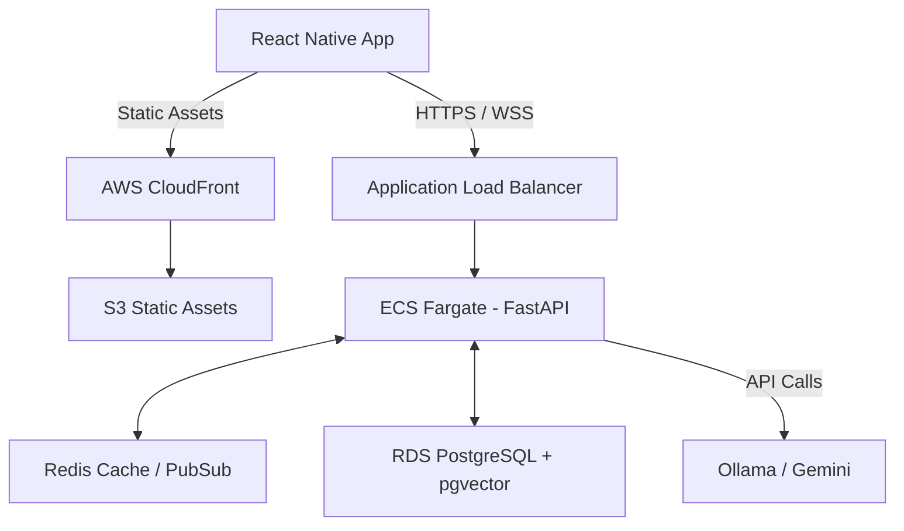

# Architecture

```mermaid
graph TD
    Client[React Native App]
    CloudFront[AWS CloudFront]
    S3[S3 Static Assets]
    ALB[Application Load Balancer]
    ECS[ECS Fargate - FastAPI]
    Redis[Redis Cache / PubSub]
    RDS[RDS PostgreSQL + pgvector]
    LLM[Ollama / Gemini]

    Client -->|Static Assets| CloudFront
    CloudFront --> S3
    Client -->|HTTPS / WSS| ALB
    ALB --> ECS
    ECS <--> Redis
    ECS <--> RDS
    ECS -->|API Calls| LLM
```
