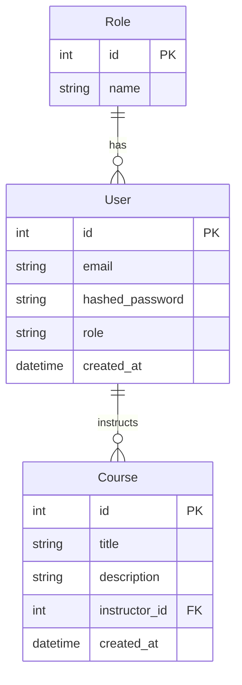

# Entity-Relationship Diagram

```mermaid
erDiagram
    User {
        int id PK
        string email
        string hashed_password
        string role
        datetime created_at
    }
    
    Role {
        int id PK
        string name
    }

    Course {
        int id PK
        string title
        string description
        int instructor_id FK
        datetime created_at
    }

    User ||--o{ Course : "instructs"
    Role ||--o{ User : "has"
```
