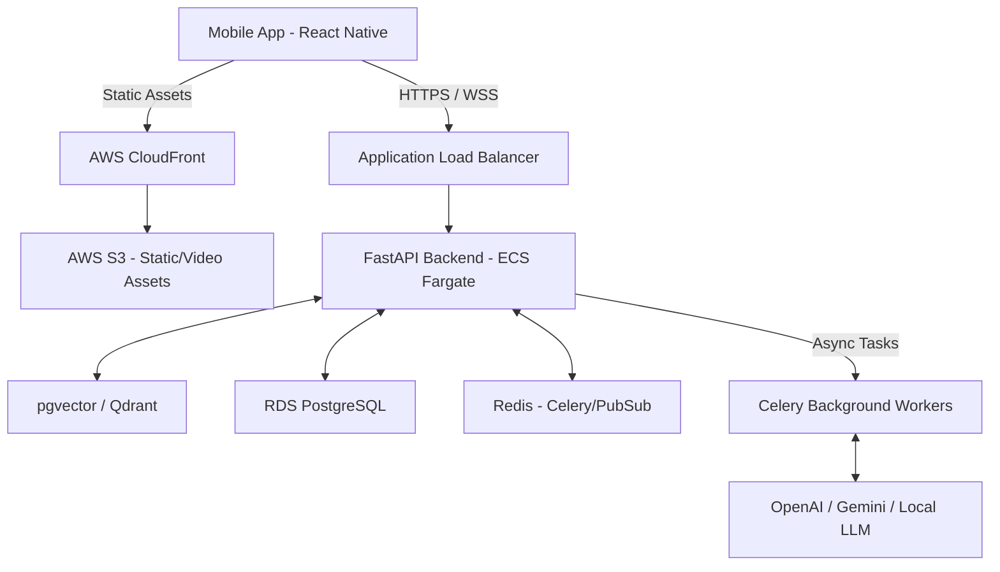

# System Architecture - SkillSprint

## Core Components
- **Mobile Client**: Expo SDK based React Native app using Zustand for global state and React Query for server cache.
- **API Gateway/Backend**: FastAPI orchestrating business logic, auth, and websockets.
- **AI/LLM Layer**: RAG pipeline utilizing vector search against course transcripts to ground the AI Tutor.
- **Asynchronous Workers**: Celery workers handle video encoding, thumbnail generation, and LLM query processing.
