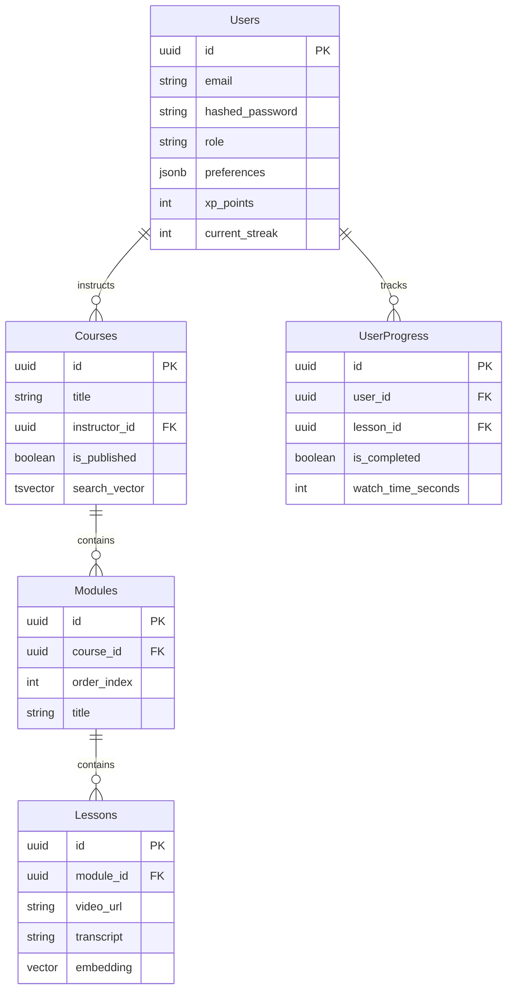

# Database Schema & Indexing Strategy - SkillSprint

## Indexing Strategy
- **B-Tree Indexes**: `Users.email`, `Courses.instructor_id`, `UserProgress.user_id`.
- **GIN Indexes**: `Courses.search_vector` for fast full-text search.
- **HNSW / IVFFlat Indexes**: `Lessons.embedding` via pgvector for fast semantic search and RAG retrieval.
